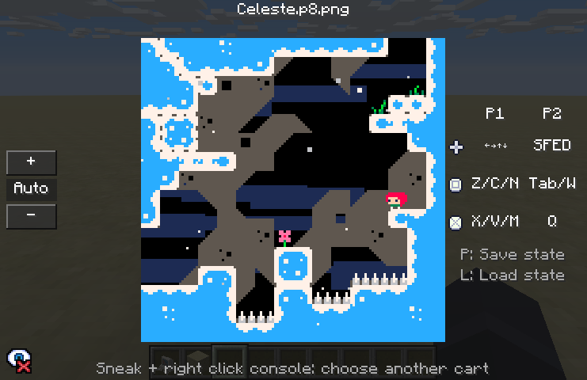

# PICO-8 GTNH

**在 GTNH 运行 PICO-8 主机游戏   Run PICO-8 games in GTNH**

---

### 下载 Downloads
| GTNH            | Download                                                                                                                                   |
|-----------------|--------------------------------------------------------------------------------------------------------------------------------------------|
| 2.9.0 beta1-RC2 |            |
| 2.8.4           |  |

> [!NOTE]
> 2.8.4: 目前仅客户端。不添加主机方块，请使用`/pico8`命令  
> 2.8.4: Client only for now. No block added, only command `/pico8`

---

## 功能 Features

- 在 GTNH 里玩各种小游戏   Play mini-games in GTNH
- 游戏内搜索及下载卡带   Browse & download cartridges in game
- 即时存档 / 回放功能   Quick Save/Load
- 支持仅客户端，在没有 Mod 的服务器上可使用指令运行   Support client only mode, starts via commands

### 计划中 TODO：

- 多人游玩 / 围观   Multiplayer support and screen sharing

---

## 截图 Screenshots

---

## Credits

- [PICO-8](https://www.lexaloffle.com/pico-8.php) - A fantasy console by Lexaloffle.
- PICO-R - A PICO-8 WASM emulator.
- [wasmtime-java](https://github.com/kawamuray/wasmtime-java) - Java bindings for Wasmtime.
- [Celeste Classic](https://www.lexaloffle.com/bbs/?tid=2145) - PICO-8 cartridge included as a sample.
- [Justin's 16x16 Icon Pack](https://zeromatrix.itch.io/rpgiab-icons) - GUI button icon.
- [Controller & Keyboard Icons](https://vryell.itch.io/controller-keyboard-icons) - Controller button icon.
