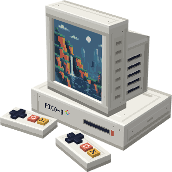

# Pico-8 GTNH

A PICO-8 game runtime mod for Minecraft 1.7.10 / GTNH.

> [!NOTE]
> GTNH 2.8.4 Version is client mode only. Use `/pico8` command.

## Credits

- [PICO-R](https://github.com/mnmlyw/pico-r) — PICO-8 emulator.
- [wasmtime-java](https://github.com/kawamuray/wasmtime-java) — Java bindings for Wasmtime.
- [Celeste Classic](https://www.lexaloffle.com/bbs/?tid=2145) — PICO-8 cartridge included as a sample.
- [Justin's 16x16 Icon Pack](https://zeromatrix.itch.io/rpgiab-icons) — GUI button icon.
- [Controller & Keyboard Icons](https://vryell.itch.io/controller-keyboard-icons) — Controller button icon.
